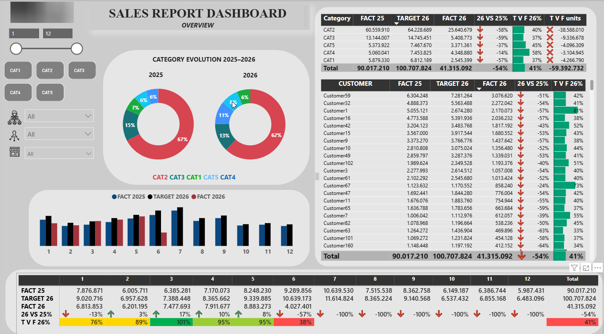

# FMCG Sales Performance & Target Tracking Dashboard

## Project Overview
An interactive FMCG Sales Dashboard developed to analyze and monitor sales performance against annual targets. The report provides actionable commercial insights by evaluating Year-over-Year (YoY) metrics and target achievement across product portfolios and client accounts.

## Key Features & Functionalities
* **Interactive Slicers:** Dynamic filtering by months and product categories (CAT1-CAT5).
* **YoY Evolution:** Visual tracking of market share and distribution shifts between 2025 and 2026.
* **Client Performance Matrix:** Detailed breakdown of target vs. actual numbers per customer with advanced conditional formatting (KPI indicators and data bars).
* **Time-Series Analysis:** Monthly breakdown comparing past performance, current goals, and actual revenue.

## Tech Stack
* **Power BI Desktop**
* **Power Query** (ETL & Data Anonymization)
* **DAX** (Custom metrics for target variance and conditional formatting)
